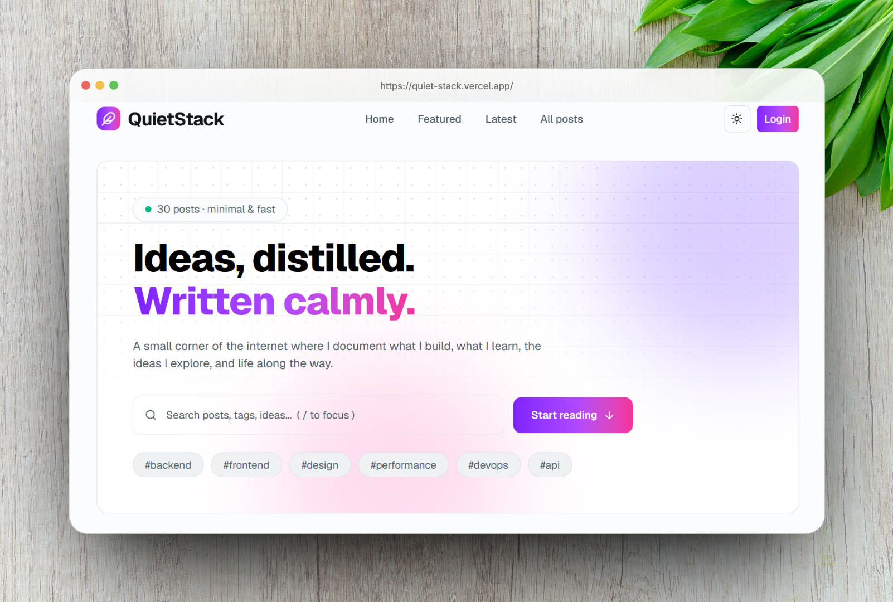
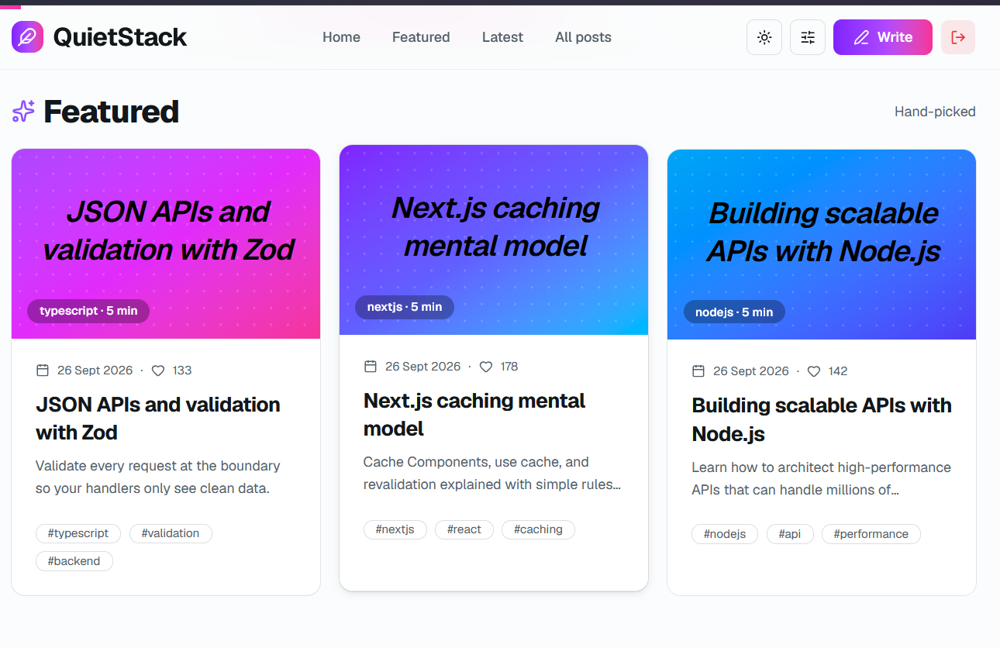
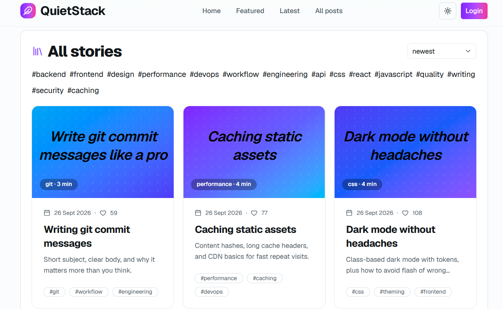
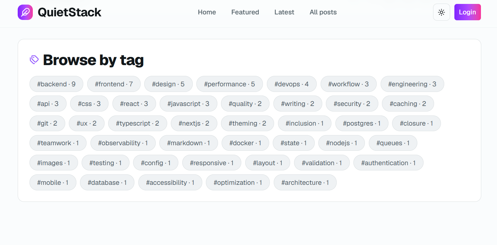
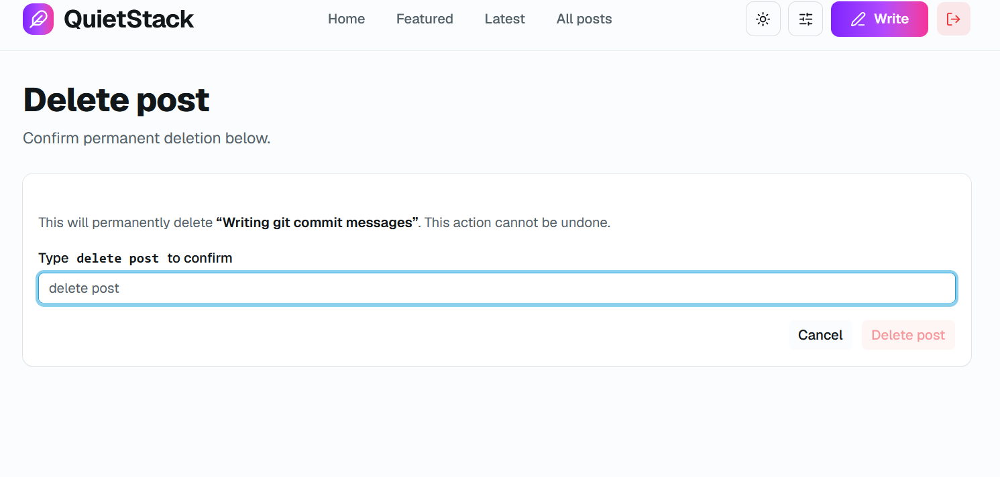
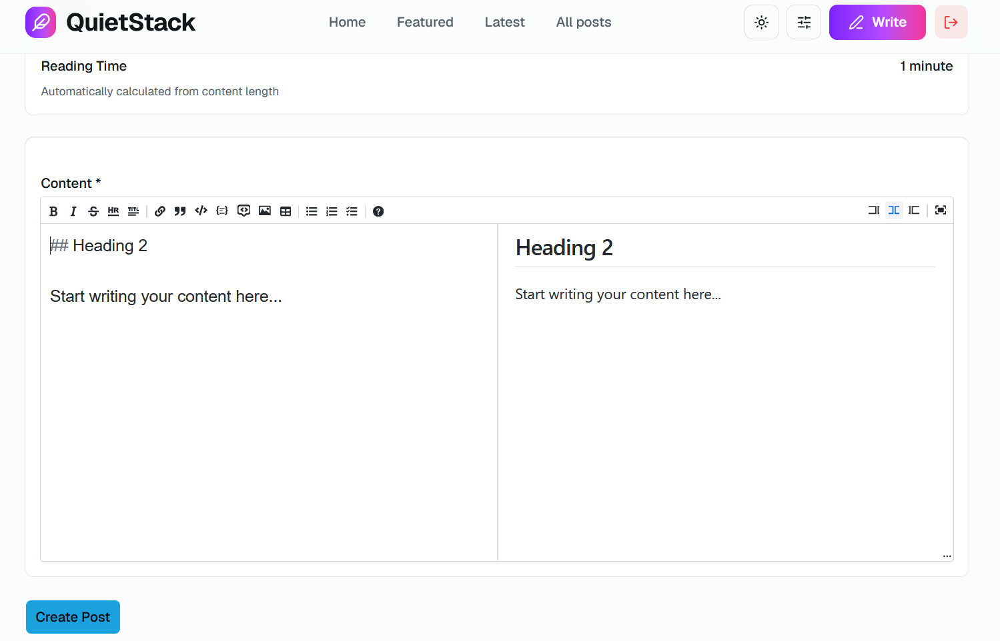
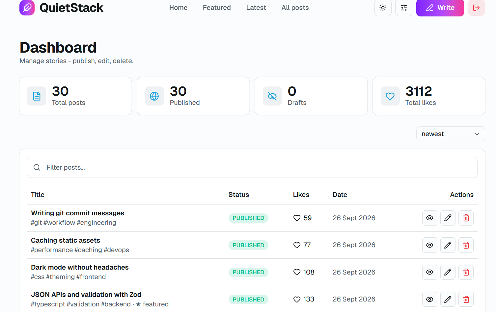

<div align="center">
  
  <h1>QuietStack</h1>
  <p>
    A modern, <b>open-source</b>, minimal and fast blogging platform.
  </p>
</div>

<div align="center">
   
</div>

## 🔭 Overview

**QuietStack** is a blog site where i write about tech, life, and other stuffs. It's a minimal blog covering everything tech plus essays on life.

I want to share my thoughts and ideas with the world. I want to write about my experiences, my learnings, and my insights. That's why I created this `personal` blog site.

## 📅 Timeline

- Sept 2026

## Live Demo 🎉

- 🌐 [link-leaf.vercel.app](https://quiet-stack.vercel.app/)

---

## 🎯 Why I Built This

- Only to share my thoughts and ideas with the world.

## Key Features

- 🔐 **Secure Admin Login** - with pre-defined username and password + `refresh token feature`
- Featured posts, latest posts, all blogs (per page max 8 post) with pagination
- Admin dashbaord display all posts with buttons: edit, preview, delete and metadata at top like: total likes, total views etc.
- Markdown editor with preview to write blogs
- Gradient colors for post cover image
- Browse post by tag
- Like posts anonymously with `fingerprintjs`
- 🔍 Search blog posts

## 📸 Screenshots

<div align="center">







</div>

## 🛠️ Tech Stack

- **Framework:** React 19 & Next.js 16 (App Router)
- **Styling:** TailwindCSS & shadcn/ui
- **State Management:** Zustand
- **Package Manager:** Bun
- **Authentication:** JWT & JOSE (access token + refresh token rotation)
- **Database:** MongoDB

## 🏗️ Project Structure

```txt
src
├───app
│   ├───(public)
│   │   ├───blog
│   │   │   └───[slug]
│   │   ├───page
│   │   │   └───[number]
│   │   ├───search
│   │   └───tag
│   │       └───[tag]
│   └───admin
│       ├───api
│       │   └───seed
│       ├───dashboard
│       │   ├───delete-post
│       │   ├───edit-post
│       │   ├───new-post
│       │   └───preview
│       │       └───[slug]
│       └───login
├───components
│   ├───private
│   │   └───admin
│   │       └───dashboard
│   │           ├───delete-post
│   │           └───post-form
│   ├───public
│   │   ├───blog
│   │   ├───blog-list
│   │   ├───home
│   │   ├───search
│   │   └───tag
│   ├───shared
│   └───ui
├───constants
├───hooks
├───lib
│   └───actions
├───models
├───store
└───types
```

## ⚙️ Scripts

```bash
bun run dev        # Start development server
bun run build      # Build for production
bun run start      # Start production server
bun run lint       # Run ESLint
bun run typecheck  # Run TypeScript type checking
bun run format     # Format code with Prettier
```

## 🧭 Local setup guide

Follow the steps below to set up Link-Leaf locally.

### 1️⃣ Clone & Install

```bash
git clone https://github.com/fazle-rabbi-dev/quiet-stack.git
cd quiet-stack
bun install
```

### 2️⃣ Set Up Environment Variables

- Copy the sample environment file:
  ```bash
  cp .env.example .env.local
  ```
- Fill in your credentials:

### 3️⃣ Run the App

```bash
bun run dev
```

> ✅ Setup Complete!
> **Great job 👏**

Link-Leaf is now running at `http://localhost:3000`.

---

g

## 🤝 Contribution

Contributions are welcome and appreciated!
If you have ideas to improve this project, feel free to get involved.

### How You Can Contribute

- 🐞 Report bugs or unexpected behavior
- 💡 Suggest new features or improvements
- 🛠️ Submit pull requests for fixes or enhancements

### Contribution Workflow

1. Fork the repository
2. Create a new branch (`feature/your-feature-name`)
3. Make your changes and commit with clear messages
4. Push to your fork
5. Open a pull request with a brief explanation

Please make sure your code follows the existing style and conventions.

---

> Even small contributions matter. If this project helped you, consider giving it a ⭐️

> [!Tip]
> ⏳Refer to [canvas.md](./_canvas.md) for the pending tasks/features.
